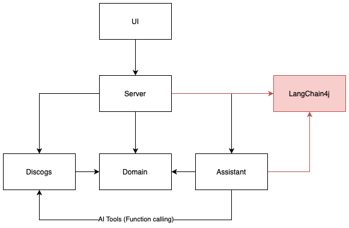

# David's vinyl specialist

David is a specialist in vinyl records. You can ask him for a recommendation or for additional information about any of the records in your Discogs collection. 
David will be happy to help you.

## Technical details

This LLM application is a simple example of a conversational agent that uses the Discogs API to provide information about vinyl records.
It consists of 4 main building blocks:

1. **Discogs API client**: Given a username, it retrieves the collection of vinyl records from the Discogs API.
2. **AI assistant engine (David)**: Given a record collection, it provides a conversational interface about the records.
3. **Websockets server**: It provides a websockets server to interact with the AI assistant.
4. **User interface**: It provides a simple user interface to interact with the AI assistant through websockets.

It currently uses the [LangChain4j](https://docs.langchain4j.dev) as framework with GPT-4o as the AI assistant engine, but it can be easily adapted to use other engines.

The application architecture from below diagram is enforced by the ArchUnit framework through tests in the [ArchitectureTest](src/test/kotlin/io/github/gprindevelopment/recommender/ArchitectureTest.kt) class.



## Lessons learned

The UI for this project was developed using the following prompt:

```
I need the code for an HTML 5 page that contains an input field for a Discogs username 
and a text area for inserting prompts for the application to send to AI agents. 
Above the text area there should be the space in which the AI responses are displayed, in the ChatGPT style
```

The generated HTML5 code from GitHub Copilot gave the initial visuals for the UI 
which I then modified to add the websocket connection and the logic to send and receive messages from the AI assistant.
I found this to be a very quick approach to prototyping. Then, I moved to more robust components from ant-design, including [pro-chat](https://github.com/ant-design/pro-chat).

I initially wanted to use llama3. The llama3 model currently has no support for tools (June 2024). This means that the AI assistant cannot collect the Discogs username and retrieve the record collection on its own. We moved to GPT-4o so David can ask for Discogs information and remove the need for any forms.

Some LLMs are not as smart as others. Even though Mistral 7b model supports tools, 
I was not able to get good answers from it. It would not even pass my integration tests.
With that, I was not able to run an LLM with tools free of charge.

Hallucinations are a pain. I am beginning my journey into RAG as a way to minimize it.
Since David operates in the domain of music, Wikipedia is the first knowledge base that comes to mind for RAG.
Maybe I can leverage the MediaWiki API for searching music pages that are relevant to the conversation.
For now, I am using just Google Search and it helps sometimes but definately not enough for the cost it adds with tokens.

Testing the LLM application was a challenge. I did more integration tests than usual. This led to a slower development cycle.
Also, the probabilistic nature of the AI assistant makes it hard to test the application in a deterministic way.

In the LLM world unit tests involve prompting an AI model instead of just calling a unit of code. When using a cloud-based model, running unit tests has a cost.
I also experimented with using a second AI agent to help me with asserting results from the main AI. It is a promising approach since we can do semantic assertions, and not just string processing. The tradeoff here is that it also generates cost, and stacks the risk of probability errors introduced by LLMs.

## Go right/wrong

1. Go right: Few-shot prompting. The results from the recommender improved significantly when I applied this technique to my system prompt. I added the persona, the tone, some context behind the conversation and a few examples on what would be expected from the AI to do.
2. Go right: AI test reviewer. Assertions from the AI integration tests often involved string processing. I thought using another AI specialized in reviewing test outcomes would facilitate the process. I would give it a statement and the response from the main AI, and the test reviwer would return if its a pass or fail. It led to flaky tests with using llama3 due to the accumulation of probabilistic errors of both AIs working together. When moving to GPT-4o, it proved to be a very nice tool. It enabled semantic assertions. Use your most powerful LLM for test assertions.
4. Go right: Tools. I initially fetched the collection of vinyl records from Discogs using application code and added it to the system prompt of the LLM. This approach required an input field on the UI for collecting this data. When changing to tools, the AI would be able to collect the Discogs username from the user on its own, and make it all more conversational. It eliminates the need for UI forms.
5. Go wrong: Cost. Adding features to the AI agent involves increasing the number of tokens that goes into each chat. It increases even more when using a fine-tuned model. The more we increase the number of examples in the few-shot prompt, the more we will pay for the system prompt messages. Using GPT-4o has high cost at this moment, and the choice of LLM to use should be carefully considered. LangChain helps with an abstraction layer that makes it easy to change the underlying LLM.
6. Go wrong: Using Ollama and llama3. I initially used llama3 running inside Ollama as a way to prototype a gen AI application for free. It worked initially, but it quickly led to very slow development cycles. My test suite would take 5 minutes to run with 20 tests while running a reusable test container. Running the application had a ~1 minute cold start delay for starting the conversation. I had to substitute it for a cloud-based LLM like ChatGPT 3.5.

## How to run

You must have a valid OpenAI API key to run this application.

1. Clone the repository.
2. Run `./gradlew bootRun` to start the application.
3. Visit `http://localhost:8080` in your browser to interact with the AI assistant.

